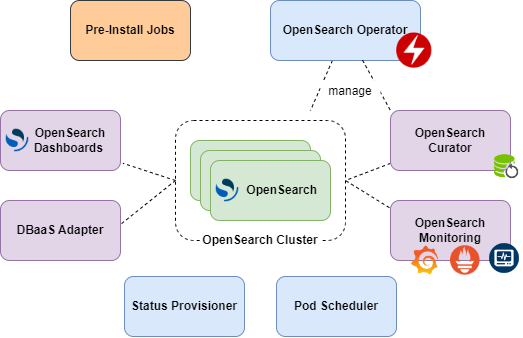
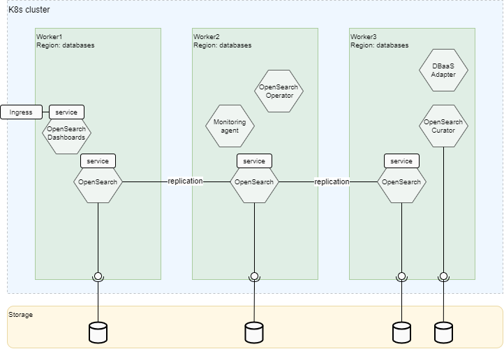
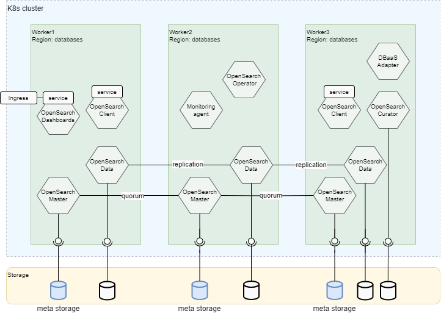
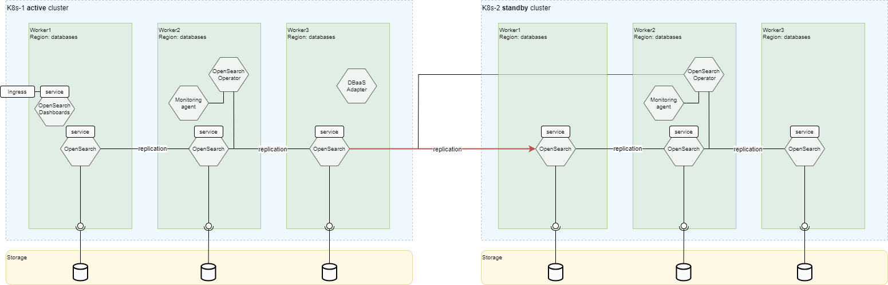
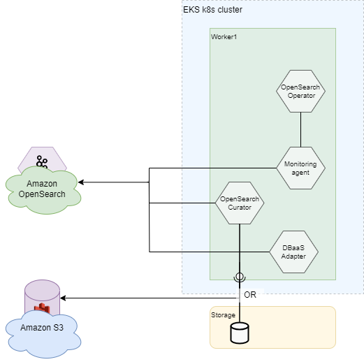

[[_TOC_]]

# Overview

OpenSearch is a powerful open-source and fully free search and analytics engine that serves as a viable alternative to proprietary solutions like Elasticsearch. 
It is necessary because it enables businesses to implement efficient search functionality within their applications, websites, or data analysis platforms. 
OpenSearch offers advanced search capabilities, including full-text search, faceted search, and real-time indexing, empowering businesses to deliver fast and accurate search results to their users.

The business value of OpenSearch lies in its ability to enhance user experience, increase customer engagement, and drive better decision-making. 
By integrating OpenSearch, products can improve search relevance, enabling users to find the desired information quickly and easily. 
This, in turn, leads to improved customer satisfaction, increased conversions, and enhanced retention rates.

In summary, OpenSearch is necessary for businesses as it empowers them to deliver efficient search functionality, improve user experience, make informed decisions through analytics, and realize cost advantages compared to proprietary alternatives.

## Netcracker OpenSearch Delivery and Features

The Netcracker platform provides OpenSearch deployment to Kubernetes/OpenShift using helm chart based on community OpenSearch Helm chart with own operator and additional features.
The deployment procedure and additional features include the following:

* Support of Netcracker deployment jobs for HA scheme and different configurations. For more detailed information, refer to [Installation Guide](/documentation/installation-guide/README.md).
* Backup and restore data. For more detailed information, refer to [OpenSearch Curator Guide](https://git.netcracker.com/PROD.Platform.ElasticStack/docker-elastic-curator/-/blob/master/README.md).
* Monitoring integration with Grafana Dashboard and Prometheus Alerts. For more detailed information, refer to [Monitoring Guide](/documentation/maintenance-guide/monitoring/README.md).
* User Interface (UI) provided by OpenSearch Dashboards.
* DBaaS Adapter for OpenSearch integration. For more detailed information, refer to [OpenSearch Curator Guide](https://git.netcracker.com/PROD.Platform.ElasticStack/dbaas-opensearch-adapter/README.md).
* Disaster Recovery scheme with data replication. For more detailed information, refer to [Disaster Recovery Guide](/documentation/installation-guide/disaster-recovery/README.md).

# OpenSearch Components

## OpenSearch Operator

The OpenSearch Operator is a microservice designed specifically for Kubernetes environments. 
It simplifies management of OpenSearch clusters, which are critical for distributed coordination.
With the OpenSearch Operator, administrators can easily maintain their OpenSearch security configurations, focusing on other important aspects of their applications without worrying about the intricacies of cluster management.

In addition, OpenSearch operator performs disaster recovery logic and orchestrates OpenSearch switchover and failover operations. 

## OpenSearch

The OpenSearch is custom distribution of original OpenSearch adapted for cloud environment, offering additional features and tools for enhanced functionality and management. 
It incorporates logging capabilities to capture and analyze important system events. 
Additionally, it includes health check functionalities and other tools, streamlining the monitoring and maintenance of OpenSearch clusters. 
With this enhanced Docker container, users can effortlessly deploy and manage robust and secure OpenSearch environments with comprehensive tooling support.

## OpenSearch Curator

The OpenSearch Curator is a microservice that offers a convenient REST API for performing backups and restores of OpenSearch indices using OpenSearch Snapshot API. 
It enables users to initiate backups and restores programmatically, making it easier to automate these processes. 
Additionally, the daemon allows users to schedule regular backups, ensuring data protection and disaster recovery. 
Furthermore, it offers the capability to store backups on remote S3 storage, providing a secure and scalable solution for long-term data retention.

One more feature of OpenSearch Curator is cleaning old indices by provided configuration pattern and schedule. 
It  provides significant business value by optimizing storage utilization, improving search performance, and reducing operational costs associated with managing and maintaining large volumes of outdated data.

## OpenSearch Monitoring

The OpenSearch Monitoring microservice is built on the Telegraf framework, specializing in collecting and analyzing metrics from OpenSearch. 
It seamlessly integrates with OpenSearch clusters, capturing essential data points for performance monitoring and analysis. 
Additionally, the microservice provides a Grafana dashboard, offering a comprehensive visualization of OpenSearch metrics for better insights and diagnostics. 
It also includes an alerting system to promptly notify administrators of any potential issues or anomalies detected within the OpenSearch environment. 
With OpenSearch Monitoring, users can effectively monitor the health and performance of their OpenSearch clusters, enabling proactive management and maintenance.

## DBaaS Adapter

The DBaaS Adapter microservice implements the Database-as-a-Service (DBaaS) approach for OpenSearch. In the terms of DBaaS OpenSearch the database is a logical scope of entities (indices, aliases and templates) with the same prefix name.
When users create database the DBaaS Adapter generates prefix and creates user with right for all entities of generated prefix name.

## OpenSearch Dashboard

The OpenSearch Dashboard is a user interface (UI) tool designed for OpenSearch by Amazon, providing a user-friendly platform to manage OpenSearch indices and perform read and write operations. 
With AKHQ, users can easily navigate and monitor OpenSearch indices, manage security and monitor performance. 
It simplifies OpenSearch administration tasks, enabling efficient management of OpenSearch clusters through a comprehensive and intuitive interface.

## Pod Scheduler

The Pod Scheduler is a service running as a pod in Kubernetes, is responsible for binding specific pods of the OpenSearch StatefulSet to designated Kubernetes nodes based on configuration. 
This scheduler ensures that pods requiring host-path persistent volumes are assigned to the appropriate nodes, aligning with the defined configuration. 
By orchestrating this allocation process, the scheduler optimizes resource utilization and enables efficient utilization of host-path persistent volumes within the Kubernetes cluster.

## Status Provisioner

The Status Provisioner service is designed to monitor the health of all OpenSearch components and relay their status information in the App | DP Deployer contract. 
It checks the availability and functionality of various OpenSearch components after deployment that they are functioning properly. 
By providing this status information in the Deployer contract, the Status Provisioner service enables seamless integration with other systems that rely on the health and operational status of OpenSearch components.
After providing status the Status Provisioner pod is auto-removed.

## Pre-Install Jobs

The set of pre-install hooks which allow to prepare environment for OpenSearch installation. It includes:
* TLS Init Job - generate self-signed certificates for OpenSearch modules.

# Supported deployment schemes
## On-Prem
### HA Joint Deployment Scheme

Following the above pictures, let us describe the main parts of the OpenSearch K8s deployment:

* The minimal number of replicas for HA schema of OpenSearch is 3.
* OpenSearch pods are distributed through Kubernetes nodes and availability zones based on affinity policy during deployment.
* Each OpenSearch pod has its own Persistent Volume storage.
* In addition to OpenSearch main storage, the OpenSearch Backup Daemon pod has its own Persistent Volume for backups.
* OpenSearch Monitoring pod is deployed near OpenSearch cluster and collects corresponding metrics.
* OpenSearch Dashboard pod is deployed with Ingress to access to UI.
* DBaaS Adapter pod communicates with DBaaS Aggregator and perform corresponding operations to OpenSearch.
* All components are deployed by Helm.

### Non-HA Deployment Scheme

For a non-HA deployment scheme, it is possible to use one pod of OpenSearch cluster.

### HA Separated Deployment Scheme

In the separated mode it is possible to deploy OpenSearch pods with the different roles and provide more load distribution:
* Master nodes perform coordination and partition assignment. They also require small storage to store meta information.
* Data nodes store indices data.
* Client nodes accept client request and forward then to corresponding master nodes.

### DR Deployment Schema

Thr Disaster Recovery scheme of OpenSearch deployment assumes that two independent OpenSearch clusters are deployed for both sides on separate Kubernetes environments with indices replication between them.

The OpenSearch provides replication of indices data between OpenSearch clusters via Cross CLuster Replication plugin (red arrows).

More detailed these schemes are described in [Disaster Recovery Guide](/documentation/installation-guide/disaster-recovery/README.md).

## Integration With Managed Services

### Google Cloud
Not Applicable: default HA scheme is used for deployment to Google Cloud.

### AWS OpenSearch

The OpenSearch Service allows you to deploy OpenSearch supplementary services (Monitoring, DBaaS Adapter, Curator) without deploying OpenSearch, using Amazon OpenSearch connection and credentials. 
Thus, the features and functions of these services are adopted to Amazon OpenSearch and available as for Netcracker OpenSearch delivery. 

For more information, refer to [Amazon OpenSearch](/documentation/installation-guide/amazon/README.md).

### Azure
Not Applicable: default HA scheme is used for deployment to Azure.